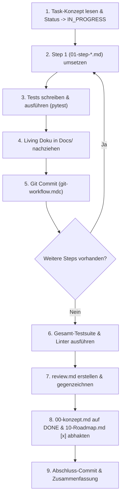

# Task-Ausführungs-Workflow: Autonome Umsetzung von Task-Paketen

## Zweck & Ziel
Dieser Workflow beschreibt die **vollautomatische Umsetzung** eines vorbereiteten Task-Pakets aus `tasks/task-X.Y-.../`. Er dient als Prompt-Instruktion für den Agenten in einer frischen Chat-Session. Ziel ist die lückenlose Umsetzung des Konzepts inkl. Code, Tests (Happy Path + Edge Cases), automatischen Git-Commits, Living-Documentation-Updates und Review-Protokollierung – ohne manuelle Eingriffe des Nutzers.

---

## 1. Start-Trigger & Voraussetzungen
Der Nutzer startet einen frischen Chat mit dem Befehl:
> *"Bitte setze den [Task-Ordner, z.B. tasks/task-4.10-auswertungen-und-reports] gemäß tasks/workflows/task-execution-workflow.md autonom um."*

**Voraussetzung**: `00-konzept.md` des Tasks steht im Status `READY`.

---

## 2. Ablauf der autonomen Umsetzung



---

## 3. Regeln & Vorgaben je Ausführungsschritt

### Schritt 1: Initialisierung
- Setze den Status in `00-konzept.md` von `READY` auf `IN_PROGRESS`.
- Analysiere die exakte Reihenfolge aller Step-Dateien (`01-step-*.md`, `02-step-*.md`, ...).

### Schritt 2: Iterative Step-Umsetzung
Arbeite jeden Step nacheinander wie folgt ab:

1. **Code-Implementierung**:
   - Halte dich strikt an die Vorgaben in `0X-step-*.md` und `.agents/rules/code-standards.mdc`.
   - **Sprache**: Code, Docstrings, Typ-Hinweise (Python 3.12+) und Kommentare ausschließlich auf **Englisch** (gemäß `.agents/rules/language.mdc`).

2. **Test-Abdeckung (Mandatory)**:
   - Schreibe und führe die im Step definierten Tests aus (Unit- & Integrationstests).
   - **Pflicht**: Nicht nur den Happy Path, sondern ausdrücklich alle im Step genannten **Edge Cases** und Fehlerfälle (z. B. ungültige Eingaben, Division durch 0, unvollständige Daten) testen (gemäß `.agents/rules/testing.mdc`).
   - Befehl: `pytest tests/path/to/test_file.py -v`

3. **Living Documentation Update**:
   - Prüfe vor dem Commit, welche Dokumente in `Docs/` von der Änderung betroffen sind.
   - Aktualisiere betroffene Konzept-Dokumente direkt im selben Schritt (gemäß `.agents/rules/living-documentation.mdc`).
   - Keine Zukunfts- oder Vergangenheitsverweise im Fließtext.

4. **Automatischer Git Commit**:
   - Führe `ruff check` und `pytest` aus.
   - Erstelle einen sauberen, atomaren Commit gemäß `.agents/rules/git-workflow.mdc`:
     - Englische Conventional Commit Message (z.B. `feat(finance): implement asset allocation report tool`).
     - Keinen ungeprüften oder kaputten Code committen.
   - Setze den Status in `0X-step-*.md` auf `DONE`.

---

### Schritt 3: Review & Qualitätssicherung
Sobald alle Step-Dateien abgearbeitet sind:

1. Führe die gesamte Testsuite des betroffenen Moduls aus: `pytest tests/`.
2. Erstelle die Datei `review.md` im Task-Ordner auf Basis der Vorlage [tasks/_templates/review-template.md](file:///c:/Daten/Entwicklung/Ralf/ComputeToAi/tasks/_templates/review-template.md):
   - Testergebnisse dokumentieren.
   - Einhaltung der Projektregeln bestätigen.
   - Gesamt-Ergebnis auf `PASSED` setzen.

---

### Schritt 4: Abschluss & Roadmap-Abhakung
1. Ändere den Status in `00-konzept.md` auf `DONE`.
2. Hake in `Docs/10-Roadmap.md` den jeweiligen Epic-Punkt von `[ ]` auf `[x]` ab.
3. Erstelle den finalen Commit:
   ```bash
   git add Docs/10-Roadmap.md tasks/task-X.Y-.../
   git commit -m "docs(tasks): mark task-X.Y as completed"
   ```
4. Gib dem Nutzer im Chat eine prägnante Abschluss-Zusammenfassung mit Links zu den geänderten Dateien und zum `review.md`.
